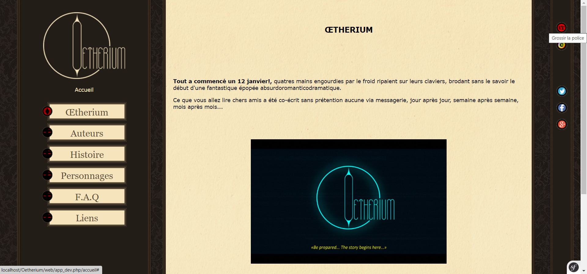

# <h1 align="center">👁️ Oetherium 👁️ </h1> 

 

L'oetherium est le nom de l'histoire écrit par 2 artistes : HellyPse et Kikile.  
Ce site Web permet de présenter l'univers de l'oetherium, son histoire et ces auteurs.  
Il a été réalisé selon les maquettes et les instructions fourni par HellyPse.  

 

En savoir plus sur l'histoire : https://www.deviantart.com/oetherium  

 

En savoir plus sur les auteurs :  
- https://www.deviantart.com/hellypse  
- https://k-zlovetch.deviantart.com/  

 

[Voir les images du site Web](#images-du-site-web)

 

## Bibliothèques
- Symfony 2
- jQuery 3.3.1
- Sonata Admin Bundle ~2.3 : création d'une interface d'administration
- egeloen/ckeditor-bundle ~2.0 : éditeur de texte pour l'utilisateur
- knplabs/knp-paginator-bundle ~2.4.2 : pagination
- friendsofsymfony/user-bundle 2.0.x-dev : gestion des utilisateurs
- friendsofsymfony/jsrouting-bundle ^1.6 : gestion du routage des pages
- imagine/Imagine >=0.2.8 et liip/imagine-bundle ~1.3.0 : gestion du format des images

## Exemples de code
- Entité CharacterStory : [CharacterStory.php](src/Apa/StoryBundle/Entity/CharacterStory.php)
- Profil CharacterStory : [seeCharacterProfile.html.twig](src/Apa/StoryBundle/Resources/views/Character/seeCharacterProfile.html.twig)
- Contrôleur Story : [StoryController.php](src/Apa/StoryBundle/Controller/StoryController.php)
- Admin - CharacterStory : [CharacterStoryAdmin.php](src/Apa/AdminBundle/Admin/CharacterStoryAdmin.php)

[imgSize]: 1000

  
<h2>Images du site Web</h2>

  
  ### <ins>Accueil</ins>
  
  
  ### <ins>Auteurs</ins>
  
 
  ### <ins>Histoire</ins>
  
 
  ### <ins>Personnages</ins>
  
 
  ### <ins>FAQ</ins>
  
 
  ### <ins>Liens</ins>
  
 
  ### <ins>Administration</ins>
  
 
  ### <ins>Admin - Liste des textes annexes</ins>
  
 
  ### <ins>Admin - Création d'un texte annexe</ins>
  
 
  ### <ins>Admin - Modification d'un texte annexe</ins>
  

